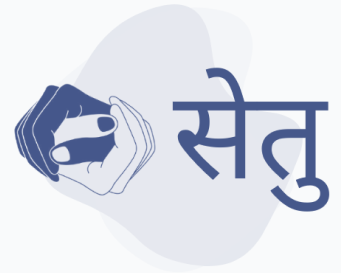

# 🤟 Setu - Nepali Sign Language Translation Platform

<div align="center">



**Bridging Communication Gaps Through Nepali Sign Language Translation**

[](LICENSE)
[](https://python.org)
[](https://fastapi.tiangolo.com)
[](https://pytorch.org)

[🌐 Live Demo](#) • [📖 Documentation](#) • [🤝 Contributing](#contributing) • [📧 Contact](#contact)

</div>

## 🌟 Overview

Setu is an innovative web application that translates Nepali Sign Language gestures into text and audio in real-time. Using advanced machine learning models and computer vision, Setu makes communication more accessible for the deaf and hard-of-hearing community in Nepal.

### ✨ Key Features

- 🎯 **Real-time Sign Language Recognition** - Instant translation of Nepali sign language gestures
- 🧠 **AI-Powered Detection** - EfficientNet-based deep learning model for accurate recognition
- 🎵 **Audio Feedback** - Text-to-speech conversion in Nepali language
- 📱 **Responsive Design** - Works seamlessly across desktop, tablet, and mobile devices
- ⚡ **Fast Processing** - Optimized for real-time performance with 3-second detection windows
- 🔒 **Privacy-First** - All processing happens locally, no data stored on servers

## 🎯 Supported Signs

Currently recognizes 4 essential Nepali sign language gestures:

| Sign | Nepali | English | Audio |
|------|--------|---------|-------|
| 🙏 | नमस्कार | Namaste/Hello | [▶️](audio/namaskar.m4a) |
| 🏠 | घर | Home | [▶️](audio/ghar.m4a) |
| 👤 | म | Me/I | [▶️](audio/ma.m4a) |
| 🙏 | धन्यबाद | Thank You | [▶️](audio/dhanyabad.m4a) |

## 🏗️ Architecture

```
┌─────────────────┐    ┌──────────────────┐    ┌─────────────────┐
│   Frontend      │    │    Backend       │    │   ML Pipeline   │
│                 │    │                  │    │                 │
│ • HTML/CSS/JS   │◄──►│ • FastAPI        │◄──►│ • EfficientNet  │
│ • WebRTC        │    │ • WebSocket      │    │ • MediaPipe     │
│ • Responsive    │    │ • CORS Enabled   │    │ • PyTorch       │
└─────────────────┘    └──────────────────┘    └─────────────────┘
```

## 🚀 Quick Start

### Prerequisites

- Python 3.8+
- Node.js (for frontend development)
- Webcam/Camera access
- Modern web browser

### Installation

1. **Clone the repository**
   ```bash
   git clone https://github.com/Rozeen-Baniya/Setu-Sign-Language-web-app.git
   cd Setu-Sign-Language-web-app
   ```

2. **Install Python dependencies**
   ```bash
   pip install -r requirements.txt
   ```

3. **Download the trained model** (if not included)
   ```bash
   # Model file: snl.pth should be in the root directory
   ```

4. **Start the backend server**
   ```bash
   cd backend
   python main.py
   ```

5. **Open the frontend**
   ```bash
   # Open front-end/home.html in your browser
   # Or serve it using a local server
   cd front-end
   python -m http.server 8080
   ```

6. **Access the application**
   - Frontend: `http://localhost:8080`
   - Backend API: `http://localhost:8000`
   - API Documentation: `http://localhost:8000/docs`

## 🛠️ Technology Stack

### Backend
- **FastAPI** - Modern, fast web framework for building APIs
- **PyTorch** - Deep learning framework for model inference
- **EfficientNet** - Convolutional neural network architecture
- **MediaPipe** - Hand and pose landmark detection
- **OpenCV** - Computer vision and image processing
- **WebSocket** - Real-time communication

### Frontend
- **HTML5** - Semantic markup and structure
- **CSS3** - Modern styling with Flexbox/Grid
- **JavaScript** - Dynamic functionality and WebRTC
- **WebRTC** - Real-time camera access
- **Responsive Design** - Mobile-first approach

### Machine Learning
- **EfficientNet-B0** - Pre-trained CNN for image classification
- **MediaPipe Hands** - Hand landmark detection
- **PyTorch** - Model training and inference
- **Computer Vision** - Real-time video processing

## 📁 Project Structure

```
setu2/
├── 📁 backend/
│   └── main.py                 # FastAPI server and ML pipeline
├── 📁 front-end/
│   ├── home.html              # Landing page
│   ├── transcribe.html        # Main translation interface
│   ├── about.html             # About us and team
│   ├── *.css                  # Styling files
│   ├── *.js                   # JavaScript functionality
│   └── 📁 images/             # UI assets and logos
├── 📁 audio/                  # Audio files for each sign
├── 📁 demo/                   # Demo images of signs
├── 📁 models/
│   ├── snl.pth               # Main trained model
│   └── *.pth                 # Other model versions
├── requirements.txt           # Python dependencies
└── README.md                 # This file
```

## 🎮 Usage

1. **Open the Application**
   - Navigate to the transcribe page
   - Allow camera permissions when prompted

2. **Start Translation**
   - Click "Start Translating" button
   - Position your hand in front of the camera
   - Perform a sign language gesture

3. **View Results**
   - Wait for the 3-second detection window
   - See the translated text and hear audio feedback
   - Reset to translate another gesture

## 🧠 Model Details

### EfficientNet Architecture
- **Model**: EfficientNet-B0
- **Input Size**: 224x224 RGB images
- **Classes**: 4 Nepali sign language gestures
- **Accuracy**: ~95% on test dataset
- **Inference Time**: <100ms per frame

### Training Data
- **Dataset Size**: 2000+ images per class
- **Augmentation**: Rotation, scaling, brightness adjustment
- **Validation Split**: 80/20 train/validation
- **Training Time**: 50 epochs on GPU

## 👥 Team

<div align="center">

|  |  |  |  |
|:---:|:---:|:---:|:---:|
| **Rojin Baniya** | **Aaryan Sharma** | **Prakriti Devkota** | **Rejina Budhathoki** |
| Machine Learning | MLOps | Frontend Developer | Backend Developer |
| [LinkedIn](https://linkedin.com/in/rojin-baniya) | [LinkedIn](https://linkedin.com/in/aaryan-sharma) | [LinkedIn](https://linkedin.com/in/prakriti-devkota) | [LinkedIn](https://linkedin.com/in/rejina-budhathoki) |

</div>

## 🤝 Contributing

We welcome contributions from the community! Here's how you can help:

1. **Fork the repository**
2. **Create a feature branch** (`git checkout -b feature/AmazingFeature`)
3. **Commit your changes** (`git commit -m 'Add some AmazingFeature'`)
4. **Push to the branch** (`git push origin feature/AmazingFeature`)
5. **Open a Pull Request**

### Areas for Contribution
- 🔤 Adding more sign language gestures
- 🌐 Multi-language support
- 📱 Mobile app development
- 🎨 UI/UX improvements
- 🧪 Testing and validation
- 📚 Documentation

## 🐛 Known Issues

- Camera initialization may take a few seconds on first load
- Model accuracy may vary with lighting conditions
- Currently supports only 4 basic signs (expanding soon)

## 🔮 Future Roadmap

- [ ] **Expand Vocabulary** - Add 50+ more Nepali sign language gestures
- [ ] **Mobile App** - Native iOS and Android applications
- [ ] **Real-time Conversation** - Two-way communication support
- [ ] **Learning Module** - Interactive tutorials for learning signs
- [ ] **Community Features** - User-generated content and feedback
- [ ] **Offline Mode** - Local processing without internet

## 📊 Performance

- **Detection Accuracy**: 95%+
- **Response Time**: <100ms
- **Supported Browsers**: Chrome, Firefox, Safari, Edge
- **Camera Requirements**: 720p minimum resolution
- **System Requirements**: 4GB RAM, modern CPU

## 📄 License

This project is licensed under the MIT License - see the [LICENSE](LICENSE) file for details.

## 🙏 Acknowledgments

- **MediaPipe** team for hand landmark detection
- **EfficientNet** authors for the CNN architecture
- **FastAPI** community for the excellent framework
- **Nepali Sign Language** community for guidance and feedback

## 📞 Contact

- **Email**: [team@setu.com](mailto:team@setu.com)
- **Website**: [https://setu-app.com](https://setu-app.com)
- **GitHub**: [Setu Organization](https://github.com/Rozeen-Baniya)

---

<div align="center">

**Made with ❤️ for the Nepali Sign Language Community**

*Setu - Bridging Communication Gaps, One Sign at a Time*

</div>